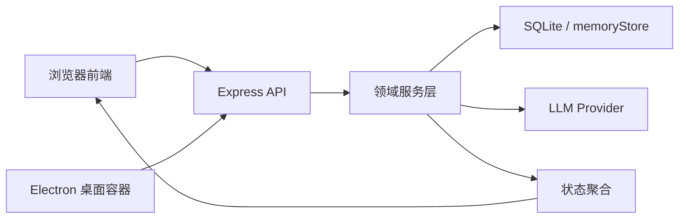

# Margin 项目理解手册 Implementation Plan

> **For agentic workers:** REQUIRED SUB-SKILL: Use superpowers:subagent-driven-development (recommended) or superpowers:executing-plans to implement this plan task-by-task. Steps use checkbox (`- [ ]`) syntax for tracking.

**Goal:** 建立一套从零解释 Margin 产品、策略与技术决策的中文项目理解手册，使项目创作者能够沿真实代码链路理解并独立讲清主要选择、代价和演进条件。

**Architecture:** 使用一份主手册建立三层全局认识，十二张独立决策卡保存可检索的技术取舍，一份代码阅读路线连接真实调用链，一份自测文档检验理解。先用 Node 测试建立文档合同，再按产品策略、系统链路、技术决策、质量风险和学习验证分批交付。

**Tech Stack:** Markdown、Node.js 20+、`node:test`、现有 Margin JavaScript/Express/SQLite/Electron 代码与测试。

## Global Constraints

- 全部新增教学内容使用中文；术语首次出现时提供中文解释并保留必要英文原词。
- 从零解释，不假设读者掌握后端、数据库或 AI 架构。
- 每项重要技术结论至少引用一个当前主线源码、配置、测试或 Git 证据。
- 论述必须明确区分“事实”“合理推断”“待确认”。
- 未整合分支只能作为候选演进，不得描述为当前主线能力。
- 每张技术决策卡必须包含候选方案、收益、代价、失败风险、代码证据、重评条件和理解检查。
- 不修改现有招聘版 Case Study 的叙事与结构。
- 不修改产品运行行为，不增加生产依赖。
- 不把自动化测试、场景验收或部署成功解释为真实用户价值成立。
- 当前主线完整回归命令固定为 `npm test`。

---

## File Map

### 新增文件

- `docs/project-understanding/MARGIN_PROJECT_UNDERSTANDING_GUIDE.zh.md`  
  主手册；负责产品层、策略层、系统地图、请求旅程、质量风险和演进路线。
- `docs/project-understanding/CODE_READING_PATH.zh.md`  
  代码阅读路线；负责按真实调用顺序引导读者阅读与运行测试。
- `docs/project-understanding/SELF_CHECK.zh.md`  
  自测题、参考答案和最终能力清单。
- `docs/project-understanding/decisions/01-node-javascript.md`
- `docs/project-understanding/decisions/02-express-api.md`
- `docs/project-understanding/decisions/03-sqlite-local-first.md`
- `docs/project-understanding/decisions/04-electron-desktop.md`
- `docs/project-understanding/decisions/05-layered-services.md`
- `docs/project-understanding/decisions/06-llm-provider-abstraction.md`
- `docs/project-understanding/decisions/07-local-fallback.md`
- `docs/project-understanding/decisions/08-layered-memory-retrieval.md`
- `docs/project-understanding/decisions/09-state-aggregation-current-line.md`
- `docs/project-understanding/decisions/10-echo-compatibility.md`
- `docs/project-understanding/decisions/11-testing-and-scenario-validation.md`
- `docs/project-understanding/decisions/12-case-study-isolation.md`
- `test/projectUnderstandingDocs.test.js`  
  文档合同测试；验证文件、章节、决策卡结构、链接和证据标签。

### 修改文件

- `README.md`  
  增加中文项目理解手册入口，并修正过时的测试数量表述，避免写死易失效数字。

---

### Task 1: 建立文档合同和证据清单

**Files:**
- Create: `test/projectUnderstandingDocs.test.js`
- Create: `docs/project-understanding/MARGIN_PROJECT_UNDERSTANDING_GUIDE.zh.md`

**Interfaces:**
- Consumes: `docs/superpowers/specs/2026-07-30-margin-project-understanding-manual-design.md`
- Produces: 后续任务共同遵守的目录、章节标题、证据标签和决策卡链接合同。

- [ ] **Step 1: 编写失败的文档合同测试**

创建 `test/projectUnderstandingDocs.test.js`，完整写入：

```js
import assert from 'node:assert/strict';
import { access, readFile } from 'node:fs/promises';
import test from 'node:test';

const root = 'docs/project-understanding';
const guidePath = `${root}/MARGIN_PROJECT_UNDERSTANDING_GUIDE.zh.md`;
const decisionFiles = [
  '01-node-javascript.md',
  '02-express-api.md',
  '03-sqlite-local-first.md',
  '04-electron-desktop.md',
  '05-layered-services.md',
  '06-llm-provider-abstraction.md',
  '07-local-fallback.md',
  '08-layered-memory-retrieval.md',
  '09-state-aggregation-current-line.md',
  '10-echo-compatibility.md',
  '11-testing-and-scenario-validation.md',
  '12-case-study-isolation.md'
];

test('project understanding guide contains the eight required chapters', async () => {
  const guide = await readFile(guidePath, 'utf8');
  for (const heading of [
    '项目全景',
    '问题与策略',
    '核心产品闭环',
    '系统地图',
    '一次请求的旅程',
    '技术决策',
    '质量、兼容与风险',
    '演进路线'
  ]) {
    assert.match(guide, new RegExp(`^## .*${heading}`, 'mu'), heading);
  }
});

test('all twelve decision cards exist and expose the standard sections', async () => {
  for (const file of decisionFiles) {
    const path = `${root}/decisions/${file}`;
    await access(path);
    const source = await readFile(path, 'utf8');
    for (const section of [
      '决策问题',
      '当时约束',
      '候选方案',
      '当前选择',
      '选择理由',
      '收益',
      '代价',
      '失败风险',
      '代码证据',
      '重评条件',
      '理解检查'
    ]) {
      assert.match(source, new RegExp(`^## ${section}$`, 'mu'), `${file}: ${section}`);
    }
  }
});

test('guide distinguishes facts, inferences, and questions requiring confirmation', async () => {
  const guide = await readFile(guidePath, 'utf8');
  assert.match(guide, /【事实】/u);
  assert.match(guide, /【合理推断】/u);
  assert.match(guide, /【待确认】/u);
});
```

- [ ] **Step 2: 运行测试并确认按预期失败**

Run:

```powershell
node --test test/projectUnderstandingDocs.test.js
```

Expected: FAIL，错误指出主手册或决策卡文件不存在。

- [ ] **Step 3: 创建主手册骨架和证据说明**

创建 `docs/project-understanding/MARGIN_PROJECT_UNDERSTANDING_GUIDE.zh.md`，包含八个正式二级标题，并在开头写明：

```markdown
# Margin 项目理解手册

> 这不是项目宣传册，而是一份帮助项目创作者理解“为什么这样做”的中文教材。

## 如何使用这份手册

- 【事实】：可由当前主线代码、测试、配置或 Git 历史直接证明。
- 【合理推断】：从实现和项目约束推导出的解释，不冒充当时的原始动机。
- 【待确认】：仓库无法证明，需要创作者根据真实经历补充。

## 01. 项目全景
## 02. 问题与策略
## 03. 核心产品闭环
## 04. 系统地图
## 05. 一次请求的旅程
## 06. 技术决策
## 07. 质量、兼容与风险
## 08. 演进路线
```

在“技术决策”章列出十二张决策卡的相对链接。此时决策卡尚不存在，因此只运行第一项章节测试：

```powershell
node --test --test-name-pattern="eight required chapters|distinguishes facts" test/projectUnderstandingDocs.test.js
```

Expected: 2 PASS，其余因名称过滤而跳过。

- [ ] **Step 4: 建立当前主线证据清单**

在主手册“如何使用这份手册”之后增加“证据入口”表，至少包含：

| 主题 | 当前主线证据 |
|---|---|
| 产品定位 | `docs/PRODUCT_POSITIONING_V2.md`、`case-study/content/case-study.zh.md` |
| API 与服务 | `src/app.js`、`src/routes/`、`src/services/` |
| 数据存储 | `src/storage/memoryStore.js`、`src/config/env.js` |
| 模型 Provider | `src/services/llm/providerRegistry.js`、`src/services/llm/providers/` |
| 桌面运行 | `electron/main.js` |
| 行为验证 | `test/` |
| 命名兼容 | `docs/MARGIN_NAMING_COMPATIBILITY.md` |

明确写出：`codex/provider-api-integration`、`codex/ui-material-system`、`codex/windows-installer` 当前不是本分支能力来源。

- [ ] **Step 5: 提交文档骨架和合同**

```powershell
git add test/projectUnderstandingDocs.test.js docs/project-understanding/MARGIN_PROJECT_UNDERSTANDING_GUIDE.zh.md
git commit -m "test: define project understanding document contract"
```

---

### Task 2: 编写产品层、策略层和系统地图

**Files:**
- Modify: `docs/project-understanding/MARGIN_PROJECT_UNDERSTANDING_GUIDE.zh.md`

**Interfaces:**
- Consumes: Task 1 的证据标签和八章结构。
- Produces: 对 Margin 产品定位、策略闭环和系统边界的从零解释，供请求旅程与决策卡引用。

- [ ] **Step 1: 为三章建立内容验收测试**

在 `test/projectUnderstandingDocs.test.js` 增加：

```js
test('guide connects product principles to system responsibilities', async () => {
  const guide = await readFile(guidePath, 'utf8');
  for (const phrase of [
    '不是通用聊天机器人',
    '先到场，再行动',
    '连续性优先于库存',
    '批注，而不是命令',
    '痕迹，而不是分数',
    '浏览器前端',
    'Express API',
    '服务层',
    'SQLite',
    'LLM Provider',
    'Electron'
  ]) {
    assert.match(guide, new RegExp(phrase, 'u'), phrase);
  }
});
```

- [ ] **Step 2: 运行测试确认失败**

Run:

```powershell
node --test --test-name-pattern="connects product principles" test/projectUnderstandingDocs.test.js
```

Expected: FAIL，首先缺少“不是通用聊天机器人”或后续术语。

- [ ] **Step 3: 完成第 1–3 章**

使用现有 `case-study/content/case-study.zh.md` 和 `case-study/content/evidence-map.md`，但改写为教学结构：

- 每章先给“你需要理解的核心问题”；
- 解释品类边界；
- 将五项产品原则逐项连接到功能或内容规则；
- 用表格解释闭环五步的输入、系统责任、输出和风险；
- 每节至少放一个【事实】锚点；
- “用户需要第二自我”“低压力继续更有效”等内容保留为【待确认】或假设。

- [ ] **Step 4: 完成第 4 章系统地图**

加入 Mermaid 图：



逐层解释职责、边界、输入输出和“为什么不由相邻层承担”。引用：

- `public/app.js`
- `src/app.js`
- `src/routes/`
- `src/services/chatService.js`
- `src/storage/memoryStore.js`
- `src/services/llm/providerRegistry.js`
- `electron/main.js`

- [ ] **Step 5: 运行目标测试并提交**

```powershell
node --test --test-name-pattern="eight required chapters|connects product principles|distinguishes facts" test/projectUnderstandingDocs.test.js
git add docs/project-understanding/MARGIN_PROJECT_UNDERSTANDING_GUIDE.zh.md test/projectUnderstandingDocs.test.js
git commit -m "docs: explain Margin product strategy and system map"
```

Expected: 相关测试 PASS。

---

### Task 3: 追踪一次请求和关键失败路径

**Files:**
- Modify: `docs/project-understanding/MARGIN_PROJECT_UNDERSTANDING_GUIDE.zh.md`
- Create: `docs/project-understanding/CODE_READING_PATH.zh.md`

**Interfaces:**
- Consumes: Task 2 的系统层级。
- Produces: 一条可复查的主调用链、一组失败路径和后续自测使用的代码阅读顺序。

- [ ] **Step 1: 增加主链路合同测试**

在测试文件增加：

```js
test('guide and reading path trace the real chat and state flow', async () => {
  const guide = await readFile(guidePath, 'utf8');
  const readingPath = await readFile(`${root}/CODE_READING_PATH.zh.md`, 'utf8');
  for (const source of [guide, readingPath]) {
    for (const anchor of [
      'public/app.js',
      'src/app.js',
      'src/services/chatService.js',
      'src/services/inputAnalyzer.js',
      'src/services/contextBuilder.js',
      'src/services/llm/providerRegistry.js',
      'src/services/echoStateEngine.js',
      'src/storage/memoryStore.js'
    ]) {
      assert.match(source, new RegExp(anchor.replaceAll('.', '\\.'), 'u'), anchor);
    }
  }
});
```

- [ ] **Step 2: 运行测试确认失败**

```powershell
node --test --test-name-pattern="real chat and state flow" test/projectUnderstandingDocs.test.js
```

Expected: FAIL，因为代码阅读路线尚不存在。

- [ ] **Step 3: 编写主手册第 5 章**

按真实代码逐步核对并写入：

```text
public/app.js 发出请求
→ src/app.js 注册路由
→ src/routes/chat.js 接收输入
→ src/services/chatService.js 编排
→ inputAnalyzer/contextBuilder 形成输入与上下文
→ providerRegistry 解析 Provider
→ echoAgent/Provider 生成回复
→ memoryStore 与领域服务保存变化
→ echoStateEngine 聚合 /state
→ 前端重新渲染当前活线
```

若真实调用关系与上面草案不同，以代码为准更新文档和测试，不得为了通过测试歪曲实现。

每一步说明：

- 输入；
- 输出；
- 为什么属于这一层；
- 失败时怎样处理；
- 对应测试。

- [ ] **Step 4: 编写代码阅读路线**

`CODE_READING_PATH.zh.md` 分为四轮：

1. 先看产品入口与 API 外壳；
2. 再看聊天主链路；
3. 再看记忆、状态、行动和学习；
4. 最后看配置、兼容、备份、Electron 与 Case Study 隔离。

每个文件包含“阅读前问题、重点函数、读完应能回答的问题、建议运行的测试”。命令使用真实测试文件，例如：

```powershell
node --test test/api.test.js
node --test test/runtimeConfig.test.js
node --test test/captureBackend.test.js
```

- [ ] **Step 5: 增加并解释失败路径**

在主手册第 5 或第 7 章覆盖：

- 缺少 API Key；
- Provider 请求失败；
- 新旧数据库路径回退；
- 禁止自动迁移；
- 备份与导入失败；
- 信息不足时不制造洞察；
- Case Study 临时数据库；
- 动态端口与 ready 所有权；
- 超时后的子进程清理。

- [ ] **Step 6: 验证并提交**

```powershell
node --test --test-name-pattern="real chat and state flow" test/projectUnderstandingDocs.test.js
git add docs/project-understanding/MARGIN_PROJECT_UNDERSTANDING_GUIDE.zh.md docs/project-understanding/CODE_READING_PATH.zh.md test/projectUnderstandingDocs.test.js
git commit -m "docs: trace Margin request and failure paths"
```

Expected: PASS。

---

### Task 4: 编写基础平台决策卡

**Files:**
- Create: `docs/project-understanding/decisions/01-node-javascript.md`
- Create: `docs/project-understanding/decisions/02-express-api.md`
- Create: `docs/project-understanding/decisions/03-sqlite-local-first.md`
- Create: `docs/project-understanding/decisions/04-electron-desktop.md`

**Interfaces:**
- Consumes: 标准决策卡结构、系统地图、当前 `package.json` 与运行代码。
- Produces: 平台、API、存储和桌面容器四项可独立阅读的决策解释。

- [ ] **Step 1: 创建四张决策卡并填满标准章节**

每张卡必须使用测试要求的十一个二级标题。内容要求：

- Node.js：比较单语言 JavaScript 与 Python 后端；不得声称仓库无法证明的早期团队技能。
- Express：比较轻量 Express、全栈框架和更强约束后端框架。
- SQLite：比较 SQLite、PostgreSQL 和纯文件存储；解释单用户、本地数据、备份和并发上限。
- Electron：比较 Electron、纯 Web/PWA 和原生桌面；说明当前依赖成本和发行风险。

使用【事实】【合理推断】【待确认】标记理由来源。

- [ ] **Step 2: 为四张卡加入真实证据**

最低证据：

```text
package.json
src/app.js
src/server.js
src/config/env.js
src/storage/memoryStore.js
electron/main.js
test/api.test.js
test/runtimeConfig.test.js
```

每个路径在提交前必须由 `Test-Path` 或文档测试验证存在。

- [ ] **Step 3: 运行决策卡合同测试**

```powershell
node --test --test-name-pattern="all twelve decision cards" test/projectUnderstandingDocs.test.js
```

Expected: FAIL，失败应从第 5 张尚未创建的决策卡开始，而不是前四张缺少章节。

- [ ] **Step 4: 提交**

```powershell
git add docs/project-understanding/decisions/01-node-javascript.md docs/project-understanding/decisions/02-express-api.md docs/project-understanding/decisions/03-sqlite-local-first.md docs/project-understanding/decisions/04-electron-desktop.md
git commit -m "docs: explain Margin platform decisions"
```

---

### Task 5: 编写服务、Provider 与回退决策卡

**Files:**
- Create: `docs/project-understanding/decisions/05-layered-services.md`
- Create: `docs/project-understanding/decisions/06-llm-provider-abstraction.md`
- Create: `docs/project-understanding/decisions/07-local-fallback.md`

**Interfaces:**
- Consumes: Task 3 的请求链路。
- Produces: 解释服务边界、模型供应商解耦和基础可用性回退的三张决策卡。

- [ ] **Step 1: 编写分层服务决策卡**

比较：

- 路由直接处理全部逻辑；
- 当前路由、服务、存储分层；
- 更重的领域架构。

引用 `src/routes/`、`src/services/chatService.js`、`src/storage/memoryStore.js` 和相关测试。明确当前服务目录较多带来的认知成本。

- [ ] **Step 2: 编写 Provider 抽象决策卡**

解释统一 Provider 接口解决什么问题，比较：

- 直接在聊天服务调用单一厂商；
- 当前 registry + provider；
- 引入外部 AI SDK。

引用 `src/services/llm/providerRegistry.js`、`src/services/llm/providers/`、`src/config/env.js`。

- [ ] **Step 3: 编写本地回退决策卡**

区分“本地规则式反思引擎”和真正本地大模型，避免误导。解释：

- 为什么外部服务失败时仍保留可用回复；
- 回退如何降低不可用风险；
- 回退质量、能力差异和可观察性代价；
- 什么时候应改成显式失败或离线模型。

引用 `src/services/echoAgent.js`、local provider 和 provider 测试。

- [ ] **Step 4: 验证阶段结果并提交**

```powershell
node --test --test-name-pattern="all twelve decision cards" test/projectUnderstandingDocs.test.js
```

Expected: FAIL 从第 8 张尚未创建的决策卡开始。

```powershell
git add docs/project-understanding/decisions/05-layered-services.md docs/project-understanding/decisions/06-llm-provider-abstraction.md docs/project-understanding/decisions/07-local-fallback.md
git commit -m "docs: explain service and provider decisions"
```

---

### Task 6: 编写产品机制与兼容决策卡

**Files:**
- Create: `docs/project-understanding/decisions/08-layered-memory-retrieval.md`
- Create: `docs/project-understanding/decisions/09-state-aggregation-current-line.md`
- Create: `docs/project-understanding/decisions/10-echo-compatibility.md`

**Interfaces:**
- Consumes: 主手册产品原则与系统链路。
- Produces: 将产品原则映射到记忆、状态聚合和兼容治理的三张决策卡。

- [ ] **Step 1: 编写记忆分层与召回决策卡**

比较：

- 保存完整对话并只按时间查找；
- 当前分层、优先级和混合召回；
- 向量数据库与语义检索。

引用 `src/services/contextBuilder.js`、`memoryPriorityEngine.js`、`memoryCalibrationEngine.js`、`src/storage/memoryStore.js` 和对应测试。说明当前规则系统的可解释性与扩展限制。

- [ ] **Step 2: 编写状态聚合与单一当前线决策卡**

解释为什么前端不应分别猜测当前行动、学习、反思和记忆。比较：

- 前端直接拼接所有原始数据；
- 当前 `/state` 聚合；
- 事件流或独立状态服务。

引用 `src/services/echoStateEngine.js`、API 合同和 view model。

- [ ] **Step 3: 编写 Echo 兼容决策卡**

覆盖：

- `MARGIN_* > ECHO_* > 默认值`；
- 新库 `data/margin.sqlite`；
- 旧库 `data/echo.sqlite` 只回退，不自动移动、复制、合并或删除；
- legacy schema 和 API alias；
- 旧仓库 URL 仍是外部标识。

引用 `docs/MARGIN_NAMING_COMPATIBILITY.md`、`src/config/env.js`、`test/runtimeConfig.test.js`、`test/marginBrand.test.js`。解释安全优先的代价是短期双命名复杂度。

- [ ] **Step 4: 验证阶段结果并提交**

```powershell
node --test --test-name-pattern="all twelve decision cards" test/projectUnderstandingDocs.test.js
```

Expected: FAIL 从第 11 张尚未创建的决策卡开始。

```powershell
git add docs/project-understanding/decisions/08-layered-memory-retrieval.md docs/project-understanding/decisions/09-state-aggregation-current-line.md docs/project-understanding/decisions/10-echo-compatibility.md
git commit -m "docs: explain memory state and compatibility decisions"
```

---

### Task 7: 编写验证与隔离决策卡并完成主手册

**Files:**
- Create: `docs/project-understanding/decisions/11-testing-and-scenario-validation.md`
- Create: `docs/project-understanding/decisions/12-case-study-isolation.md`
- Modify: `docs/project-understanding/MARGIN_PROJECT_UNDERSTANDING_GUIDE.zh.md`

**Interfaces:**
- Consumes: 前十张决策卡、测试目录和 Case Study 工具。
- Produces: 完整十二张决策卡、主手册第 6–8 章和当前演进地图。

- [ ] **Step 1: 编写测试与场景验收决策卡**

解释：

- 单元、API、合同、场景和隐私检查分别证明什么；
- 为什么测试数量不等于用户价值；
- TDD 对单人项目的收益与维护成本；
- 什么情况下需要集成测试、端到端测试或真实用户研究。

引用 `package.json`、`test/`、`docs/FUNCTIONAL_ACCEPTANCE.md` 和 Case Study 证据边界。

- [ ] **Step 2: 编写 Case Study 隔离决策卡**

解释：

- 为什么截图和演示必须使用临时 SQLite；
- 为什么使用动态端口；
- 为什么 ready 必须来自所属子进程；
- 为什么超时后必须清理；
- 固定端口、复用真实数据库和只检查端口开放的风险。

引用：

```text
scripts/case-study/capture-backend.mjs
scripts/case-study/capture-product.mjs
scripts/case-study/seed-operation-event.mjs
test/captureBackend.test.js
test/caseStudySeedIsolation.test.js
```

- [ ] **Step 3: 运行十二张卡合同测试**

```powershell
node --test --test-name-pattern="all twelve decision cards" test/projectUnderstandingDocs.test.js
```

Expected: PASS。

- [ ] **Step 4: 完成主手册第 6–8 章**

第 6 章为十二张卡写一段“先读哪张”的导航。

第 7 章整合：

- 测试分层；
- 配置与数据兼容；
- 备份和恢复；
- 隐私与临时数据；
- 失败回退；
- 当前已知质量边界。

第 8 章必须区分：

- 当前主线事实；
- 本地未提交文档债务；
- 未整合独立分支；
- 外部用户验证；
- 技术重评触发条件。

不得写死容易过期的测试总数；使用“运行 `npm test` 获取当前值”并保留 Case Study 固定历史基线的语义。

- [ ] **Step 5: 验证并提交**

```powershell
node --test test/projectUnderstandingDocs.test.js
git add docs/project-understanding/MARGIN_PROJECT_UNDERSTANDING_GUIDE.zh.md docs/project-understanding/decisions/11-testing-and-scenario-validation.md docs/project-understanding/decisions/12-case-study-isolation.md
git commit -m "docs: complete Margin technical decision guide"
```

Expected: 文档合同全部 PASS。

---

### Task 8: 编写自测题、能力清单和 README 入口

**Files:**
- Create: `docs/project-understanding/SELF_CHECK.zh.md`
- Modify: `README.md`
- Modify: `test/projectUnderstandingDocs.test.js`

**Interfaces:**
- Consumes: 完整主手册、代码阅读路线和十二张决策卡。
- Produces: 可验证的学习闭环和仓库入口。

- [ ] **Step 1: 增加自测与 README 合同**

在测试文件增加：

```js
test('self check covers product strategy technology and evolution', async () => {
  const source = await readFile(`${root}/SELF_CHECK.zh.md`, 'utf8');
  for (const section of [
    '产品理解',
    '策略理解',
    '技术理解',
    '失败与风险',
    '演进判断',
    '参考答案',
    '能力清单'
  ]) {
    assert.match(source, new RegExp(`^## .*${section}`, 'mu'), section);
  }
});

test('README links the Chinese project understanding guide without a stale test total', async () => {
  const readme = await readFile('README.md', 'utf8');
  assert.match(readme, /MARGIN_PROJECT_UNDERSTANDING_GUIDE\.zh\.md/u);
  assert.doesNotMatch(readme, /Current backend test status:\s*`19\/19`/u);
});
```

- [ ] **Step 2: 运行测试确认失败**

```powershell
node --test --test-name-pattern="self check|README links" test/projectUnderstandingDocs.test.js
```

Expected: FAIL，自测文件不存在且 README 缺少入口。

- [ ] **Step 3: 编写自测题**

至少包含：

- 5 题产品理解；
- 5 题策略理解；
- 8 题技术理解；
- 4 题失败与风险；
- 4 题演进判断。

题型以解释、比较和条件变化为主，不使用只需背术语的选择题。例如：

> 如果 Margin 从单人本地应用变成多人协作服务，SQLite 的哪些优势会减弱？你会观察哪些信号决定迁移 PostgreSQL？

参考答案放在文档后半部分，与题目之间加入明显分隔。

- [ ] **Step 4: 编写能力清单**

能力清单至少验证读者能否：

- 用一分钟解释 Margin 的定位；
- 解释五项产品原则如何改变功能；
- 画出主请求链路；
- 比较 SQLite 与 PostgreSQL；
- 解释 Provider 抽象和本地回退的区别；
- 解释旧数据库不自动迁移的安全理由；
- 说明测试证明什么、不证明什么；
- 给出三个明确的技术重评条件。

- [ ] **Step 5: 更新 README**

新增“Project Understanding”小节，链接主手册、代码阅读路线和自测。

将：

```markdown
Current backend test status: `19/19` passing.
```

替换为：

```markdown
Run `npm test` for the current test total; the suite evolves with the product and its documentation contracts.
```

- [ ] **Step 6: 验证并提交**

```powershell
node --test test/projectUnderstandingDocs.test.js
git add docs/project-understanding/SELF_CHECK.zh.md README.md test/projectUnderstandingDocs.test.js
git commit -m "docs: add Margin learning self-check"
```

Expected: 文档合同全部 PASS。

---

### Task 9: 最终链接、事实与回归验收

**Files:**
- Modify if required: `docs/project-understanding/**/*.md`
- Modify if required: `test/projectUnderstandingDocs.test.js`

**Interfaces:**
- Consumes: 全部手册产物。
- Produces: 可交付、链接有效、证据边界清楚且不影响产品测试的最终版本。

- [ ] **Step 1: 增加本地 Markdown 链接检查**

在 `test/projectUnderstandingDocs.test.js` 增加一个只验证本地相对链接的测试。实现要求：

```js
import { dirname, resolve } from 'node:path';

const markdownLinkPattern = /\[[^\]]+\]\((?!https?:|#)([^)]+)\)/gu;

async function assertLocalLinksExist(file) {
  const source = await readFile(file, 'utf8');
  for (const match of source.matchAll(markdownLinkPattern)) {
    const link = decodeURIComponent(match[1].split('#')[0]);
    if (!link) continue;
    await access(resolve(dirname(file), link));
  }
}
```

对主手册、代码阅读路线、自测和十二张决策卡逐一调用。

- [ ] **Step 2: 运行文档测试并修复真实问题**

```powershell
node --test test/projectUnderstandingDocs.test.js
```

Expected: PASS。若失败，只修复错误路径、缺失章节或不完整结构，不放宽合同掩盖问题。

- [ ] **Step 3: 执行事实与占位符审计**

运行：

```powershell
Select-String -Path docs\project-understanding\*.md,docs\project-understanding\decisions\*.md -Pattern 'TBD|TODO|待补充|占位'
Select-String -Path docs\project-understanding\*.md,docs\project-understanding\decisions\*.md -Pattern '用户验证完成|市场验证完成|证明用户价值'
```

Expected: 第一条无结果；第二条无错误宣称。若讨论这些短语，句子必须明确为“尚未完成”或“不能证明”。

- [ ] **Step 4: 运行完整回归**

```powershell
npm test
```

Expected: 全部测试 PASS，具体总数以本次运行输出为准。

- [ ] **Step 5: 检查 Git 范围**

```powershell
git diff --check
git status --short
git diff --name-only HEAD~8..HEAD
```

Expected:

- 无空白错误；
- 本计划只提交 `docs/project-understanding/`、`test/projectUnderstandingDocs.test.js`、`README.md`；
- 用户原有 `.env.example`、`package.json` 和未跟踪设计评审材料保持未提交状态，不被本计划纳入。

- [ ] **Step 6: 最终内容复核**

复核者逐项回答：

- 产品、策略、技术三层是否形成一条因果链；
- 十二张卡是否都含可信替代方案和真实代价；
- “本地回退”是否被准确描述而非冒充本地大模型；
- 未合并分支是否被明确标记；
- Case Study 固定历史测试基线与当前动态测试总数是否区分；
- 所有 Critical 和 Important 问题是否清零。

- [ ] **Step 7: 提交最终修订**

仅在 Step 2–6 产生修订时执行：

```powershell
git add docs/project-understanding README.md test/projectUnderstandingDocs.test.js
git commit -m "docs: finalize Margin project understanding manual"
```

随后重新运行：

```powershell
npm test
git status --short
```

Expected: 测试全部 PASS；仅保留实施前已经存在的用户未提交内容。

